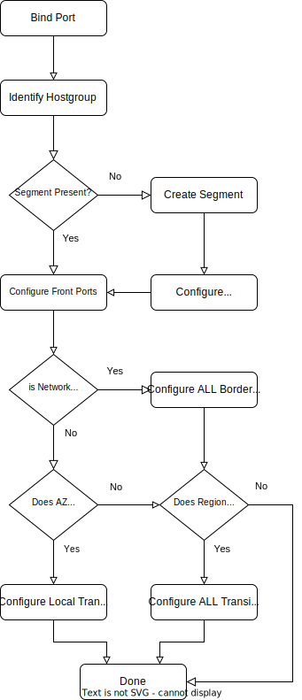

Device Config
~~~~~~~~~~~~~
This part describes the on-device config for all feature and vendor combinations.

*********
Network
*********

Workflow
########

The network to device is triggered on demand when the first resources 

Example Network Definition
##########################

::

   {
     "admin_state_up": true,
     "availability_zones": [
       "qa-de-1a",
       "qa-de-1b",
       "qa-de-1d"
     ],
     "id": "aeec9fd4-30f7-4398-8554-34acb36b7712",
     "ipv4_address_scope": "24908a2d-55e8-4c03-87a9-e1493cd0d995",
     "mtu": 8950,
     "name": "FloatingIP-external-sfh03-eude1",
     "project_id": "07ed7aa018584972b40d94697b70a37b",
     "router:external": true,
     "segments": [
       {
         "provider:network_type": "vxlan",
         "provider:physical_network": null,
         "provider:segmentation_id": 10394
       },
       {
         "provider:network_type": "vlan",
         "provider:physical_network": "bb301",
         "provider:segmentation_id": 3150
       },
       {
         "provider:network_type": "vlan",
         "provider:physical_network": "transit-leaf",
         "provider:segmentation_id": 2300
       }
       {
         "provider:network_type": "vlan",
         "provider:physical_network": "bgw",
         "provider:segmentation_id": 2340
       }
     ],
     "status": "ACTIVE",
     "subnets": [
       "14b7b745-8d5d-4667-a3e3-2be0facbb23d",
       "72f96182-d93d-4aa7-a987-edb315875c9e",
       "bbe371ae-341b-4f86-931a-e9c808cb312e"
     ],
   }

::

   global:
      asn_region: 65130

   hostgroups:
   - binding_hosts:
     - node003-bm206
     members:
     - name: Ethernet1/1
       switch: qa-de-3-sw1111a-bb206
     - name: Ethernet1/1
       switch: qa-de-3-sw1111b-bb206
   - binding_hosts:
     - node004-bm206
     members:
     - name: Ethernet2/1
       switch: qa-de-3-sw1111a-bb206
     - name: Ethernet2/1
       switch: qa-de-3-sw1111b-bb206
   - binding_hosts:
     - node005-bm206
     members:
     - name: eth1/2
       switch: qa-de-3-sw1112a-bb206-cisco
     - name: eth1/2
       switch: qa-de-3-sw1112b-bb206-cisco
   - binding_hosts:
     - node006-bm206
     members:
     - name: eth1/3
       switch: qa-de-3-sw1112a-bb206-cisco
   - binding_hosts:
     - nova-compute-bm206
     members:
     - node003-bm206
     - node004-bm206
     metagroup: true
   - binding_hosts:
     - nova-compute-bm206-cisco
     members:
     - node006-bm206
     - node005-bm206
     metagroup: true
   
   switchgroups:
   - asn: '65130.1111'
     availability_zone: qa-de-3a
     members:
     - bgp_source_ip: 1.1.11.1
       host: 10.114.0.203
       name: qa-de-3-sw1111a-bb206
       password: nope
       user: admin2
       platform: arista-eos
     - bgp_source_ip: 1.1.11.2
       host: 10.114.0.204
       name: qa-de-3-sw1111b-bb206
       password: nope
       user: admin2
       platform: arista-eos
     name: bb206
     role: vpod
     vtep_ip: 1.1.11.0
   - asn: '65130.1112'
     availability_zone: qa-de-3a
     members:
     - bgp_source_ip: 1.1.12.1
       host: 10.114.0.205
       name: qa-de-3-sw1112a-bb206-cisco
       password: nope
       user: admin
       platform: cisco-nx-os
     - bgp_source_ip: 1.1.12.2
       host: 10.114.0.206
       name: qa-de-3-sw1112b-bb206-cisco
       password: nope
       user: admin
       platform: cisco-nx-os
     name: bb206-cisco
     role: vpod
     vtep_ip: 1.1.12.0

Single AZ Network
-----------------
Networks with a single AZ are identified by having a availability_zones list of size 1.

::

    {
     "availability_zones": [
       "qa-de-1a",
     ],
    }

Multi AZ Network
-----------------
Networks with a single AZ are identified by having a availability_zones list of size N.

::

    {
     "availability_zones": [
       "qa-de-1a",
       "qa-de-1b",
       "qa-de-1d"
     ],
    }

On Device configuration
#######################

Driver Configuration
--------------------

aPOD/vPOD/stPOD/netPOD/bPOD/Transit leafs
-----------------------------------------

**EOS**:
::

   interface Vxlan1
      vxlan vlan 3150 vni 10394

   vlan 3150
      name aeec9fd4-30f7-4398-8554-34acb36b7712/bb301

   router bgp 65130.1112
     vlan 3150
         rd 65130.1112:10394
         route-target both 65130:10394
         redistribute learned

**NX-OS**:

Border Gateway
--------------

**EOS**:
::

   interface Vxlan1
      vxlan vlan 2340 vni 10394

   vlan 2420
      name aeec9fd4-30f7-4398-8554-34acb36b7712/bgw

   router bgp 65130.1103
      vlan 2340
         rd evpn domain all 65130.1103:10394
         route-target both 65130:10394
         route-target import export evpn domain remote 65130:10394
         redistribute learned

**NX-OS**:

Legacy Fabric Integration
#########################

The transit (or L2 Trunk) is used to connect the fabric to another ml2
top level driver. The legacy driver and this driver (networking-ccloud) both 
share responsibility for the top segment.
For this to work they need to be interconnected. This means that whenever
an OpenStack network should be present both on legacy and networking-ccloud side
it requires a transit segment between these two fabrics.

The transit is done by having two switch pairs connected back-to-back, one on
each side and having the drivers coordinate on the VLANs used on both sides.
Networking-ccloud will create the necessary segment, as it is on top of the hierarchy.

Other drivers will have to be notified of this change, options are:
 * having an own signal in bind_port
 * use ml2 `(create|update|delete)_port_postcommit` hooks

In config (and NetBox) each Transit will have a list of AZs associated with it
that it feels responsible for. Whenever a network is either extended across
AZs or is present in at least one AZ and on the "other side" (e.g. ACI) the
driver will schedule the network to an ACI transit for each AZ it is in.
One Transit can be responsible for multiple AZs. If a Transit is in a
different AZ than other portbindings, BGWs will be configured for inter-AZ
communication inside the fabric. When the Transit is no longer needed (e.g.
when the last port in one AZ is removed and no other AZ is using this transit
then the scheduling of this (AZ, Transit, Network) and its respective segment / VLAN
allocation will be removed.

Legacy integration scenarios
============================

The EVPN fabric driver needs to support interaction with a legacy fabric. For Neutron networks it is required to add provisioned networks not only to the leafs that are in the host group but also add the network to border gateway device for inter AZ communication as well as transit leafs to extend networks to the legacy environment.
The driver is not responsible for loop avoidance or migration of flows between fabric interconnections, this is expected to be handled via the static non-driver controlled configuration.
The following topology variations need to be supported, for below scenarios it is expected that the network is already in use in legacy.

Single AZ
---------

* **First port AZa**: Additional segment for L2 trunk EVPN<->Legacy in AZa is added.
  
Dual AZ with Dual Legacy AZ
---------------------------

.. figure:: figure/legacy_fabric_type_dual_az.svg
    :width: 300px
    :align: center
    :figclass: align-center

* **First port AZa**: Additional segment for L2 trunk EVPN<->Legacy in AZa is added.
* **First port AZb**: Additional segment for L2 trunk EVPN<->Legacy in AZb is added.
* **Second port AZa or AZb**: Additional BGW segment in AZa and AZb is added, AZX L2 Trunk is added.

Dual AZ with Single Legacy AZ
-----------------------------

.. figure:: figure/legacy_fabric_type_dual_az_evpn.svg
    :width: 300px
    :align: center
    :figclass: align-center

* **First port AZb**: Additional segment for L2 trunk EVPN<->Legacy in AZa is added, additional BGW segment in AZa and AZb is added.
* **First port AZa**: Additional segment for L2 trunk EVPN<->Legacy in AZa is added.
* **Second port AZa or AZb**: Additional BGW segment in AZa and AZb is added if not already present.
  
Multi AZ with Multi Legacy AZ
-----------------------------

* **First port AZa**: Additional segment for L2 trunk EVPN<->Legacy in AZa is added.
* **First port AZb**: Additional segment for L2 trunk EVPN<->Legacy in AZb is added.
* **First port AZc**: Additional segment for L2 trunk EVPN<->Legacy in AZc is added.
* **Second port AZX**: Additional BGW segment in AZX and ALL AZs already having ports is added, AZx L2 Trunk is added.

Multi AZ with Dual Legacy AZ
----------------------------

.. figure:: figure/legacy_fabric_type_multi_az_evpn.svg
    :width: 450px
    :align: center
    :figclass: align-center

* **First port AZa**: Additional segment for L2 trunk EVPN<->Legacy in AZa is added.
* **First port AZb**: Additional segment for L2 trunk EVPN<->Legacy in AZb is added.
* **First port AZc**: Additional segment for L2 trunk EVPN<->Legacy in AZa AND AZb is added, BGW segment in AZc and AZa and AZb is added.
* **Second port AZX**: Additional BGW segment in AZX and ALL AZs already having ports is added, additional segment for L2 trunk in AZX is added if not already present.
 
*********
Subnet
*********

On External Network
###################

Directly Accessible Private Network 
###################################

***********
Subnet Pool
***********

***********
Floating IP
***********

***********
Port
***********

VLAN Handoff
############

Ironic
######

Neutron l3
##########
